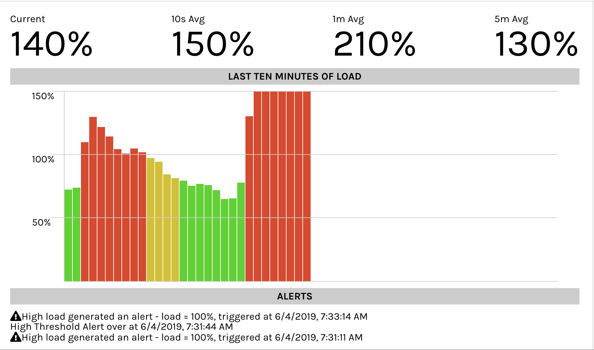

# Datadog Load Monitoring Take-Home Assignment

## Initial setup (zipped)
* unzip file
* enter new datadog-load-monitoring directory
* `yarn` or `npm install` to install dependencies

## Initial setup (git)
* clone repo
* `yarn` or `npm install` to install dependencies

## Usage
`yarn dev` to start express backend and react frontend

You should see the load monitoring service start-up. It will look like this screenshot.

While the server is open and the browser is viewing it (see System Improvements), the CPU load will be monitored on your machine. You can get the live load, 10 second average, 1 minute average and 5 minute average. You can also see the past 10 minutes graphed out. Alert will be added when your average load for the past 2 minutes spikes above 100% and 

## Choices I Made
I chose to use Create-React-App with a simple express backend to get started. I landed on polling every second for the load pretty quickly. At first, I held onto loads in an array and would reduce to get averages, but found that to be slow and there would be ocassional inaccuracies. So I decided to hold onto loads in a queue (src/utils/LoadAverage), implemented with a doubly-linked list. The queue holds onto it's length and total load, so it can easily and performantly give you the average load. I thought about a further optimization of having only one LoadAverage that could give you averages for several lengths, thus requiring less memory, but the sacrifice in readability was too much. 

For the chart, I looked into using a chart library. I made an initial chart with Google Charts, but found myself fighting the chart way too much, so I built a simple solution in CSS. In it I just have divs that are next to each other and have a height based on the load. I added colors (red for >100%, yellow for >80% and green for <80%) to more easily express to users the story of the last ten minutes.

## How I'd Improve This
1. When I started, I thought about holding onto the load and the past loads in the backend server. This is generally, in my opinion, the best practice to have a frontend that is solely concerned with displaying information and a backend that gathers and aggregates the data for the frontend. But I found the idea of polling every second in both the frontend and the backend to be a weird solution and I am far more familiar with using React and than I am with node backends. If I were to do this again, I would have listened to my experience rather than the idea that I didn't want to make a weird solution.

It would probably add an hour or perhaps two to change, so it is not set in stone. But the benefits would be:
* Load would be monitored by having the app running, so you could close the browser and still monitor
* Far increased testability, I tested the Alerts by testing the Alterer class which holds onto the logic of when to alert, but if the backend held onto the logic, I could test the display of alerts _and_ the gathering of them independently

2. I would use a more robust charting solution. The hardest part about the chart was the concept of how to label the x-axis. I ended up removing attempts to label the axis because it was so confusing to look at for the first part, when the axis is moving. Normally, in a monitoring solution, the backend would be an long-running monitor, which would hold onto the information and what to show when there isn't enough information would be a trivial decision. But in this case, most of the time I was looking at the monitor, it was before there was ten minutes of data.
The other issue I had with charting, was that when loads got high, they would go quite high, so where to cut off the y-axis was unclear. I chose 150% because making it higher would remove granularity when the load is in the normal range. Most charting libraries allow you to resize based on what the data is, so if I used d3 or highcharts or made my own, that would be a part of it. Dynamic resizing to show the most granularity.

